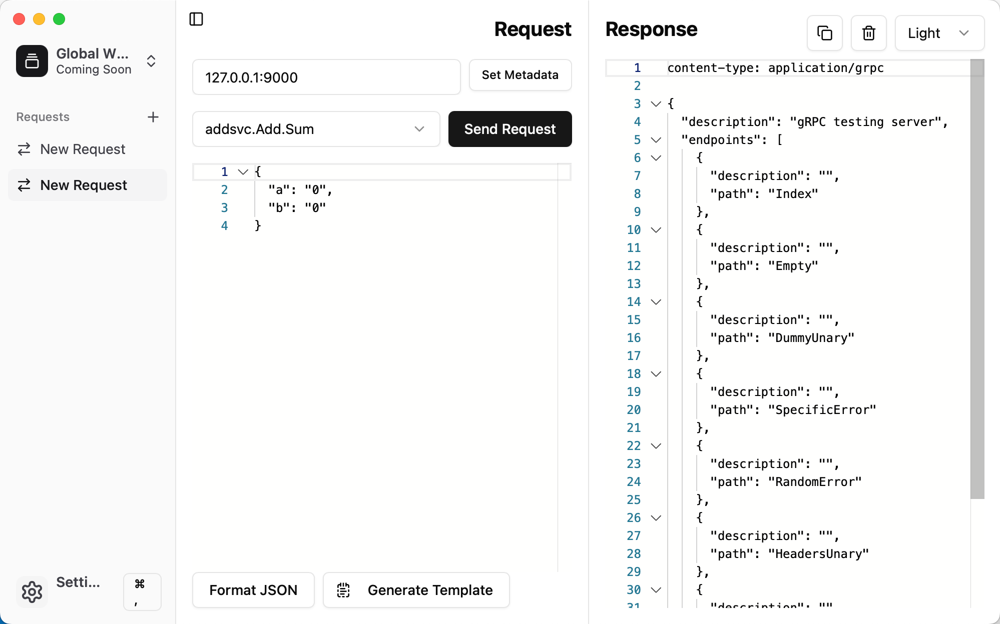

# grpcmd-gui


grpcmd-gui is a modern cross-platform desktop app for gRPC API development and testing.

## Demo


## Features
- Supports fetching methods from reflection and .proto files.
- Supports sending request headers.
- Supports viewing response headers and trailers.
- Supports set request header(metadata) with JSON data.
- Supports generating a request template in JSON.
- Supports streaming request and response messages.
- Supports format the JSON data of request and response.
- Supports copy or clean the JSON data of response.
- Supports set request and response data witch snake_case.
- Supports customization via multiple themes.
- Supports multiple requests per window session.
- Supports keyboard shortcuts (such as `Cmd/Ctrl + T` to create a new request).
- Supports collapsing the sidebar and resizing the panels.
- Supports automatic timed deletion of open requests.
- Supports persisting and live reloading workspace configuration from disk.

## Installation

### Binary
You can also download the binary files for macOS, Linux, and Windows from the [Releases](https://github.com/serialt/grpcmd-gui/releases) page.

### Build
You need to have `Go`, `NPM`, and `Task` installed and available on your machine to proceed.
```
[root@Krab grpcmd-gui]🐳 
[root@Krab grpcmd-gui]🐳 task package
```

## Thanks for
* [grpcmd-gui](https://github.com/grpcmd/grpcmd-gui)